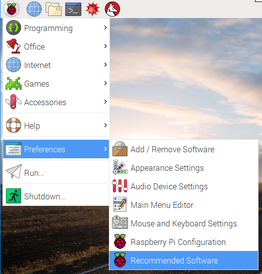
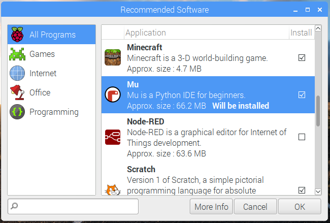

## What you will need

### Hardware

* BBC micro:bit
* USB A to micro USB-B cable

### Software

#### Software installation

You will need the Python `pyowm` library. You can install this by typing the following into LXTerminal:

```bash
sudo pip3 install pyowm
```

You will also need to install Mu from **Recommended Software** in **Preferences**:





For more information on installing and how to use Mu see [Getting started with Mu](https://projects.raspberrypi.org/en/projects/getting-started-with-mu).