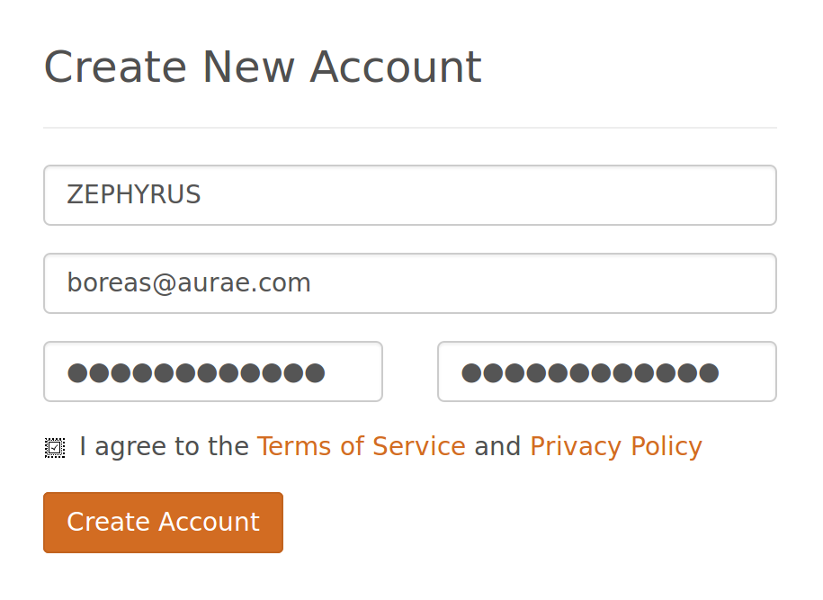
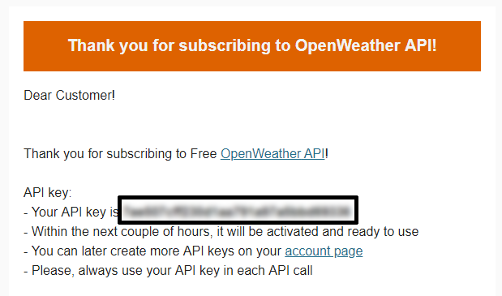

## Accessing OpenWeatherMaps

The first thing you'll have to do is get access to a **weather API**. API stands for Application Programming Interface. This sounds complicated, but it's just a set of rules telling your programs how to talk to other software.

-  The weather service you're going to use in this resource is called [OpenWeatherMap](http://openweathermap.org/). It's a completely free service, and has an easy-to-use API. You're going to need your own account though, so click on the link to go to the website.

-  Click on 'Sign Up':

	

-  Choose a username, type in your email address and then provide a password:

	

-  Once you're logged in, you should see a page with your **secret** API key. This is important, so copy it to your clipboard:

	

