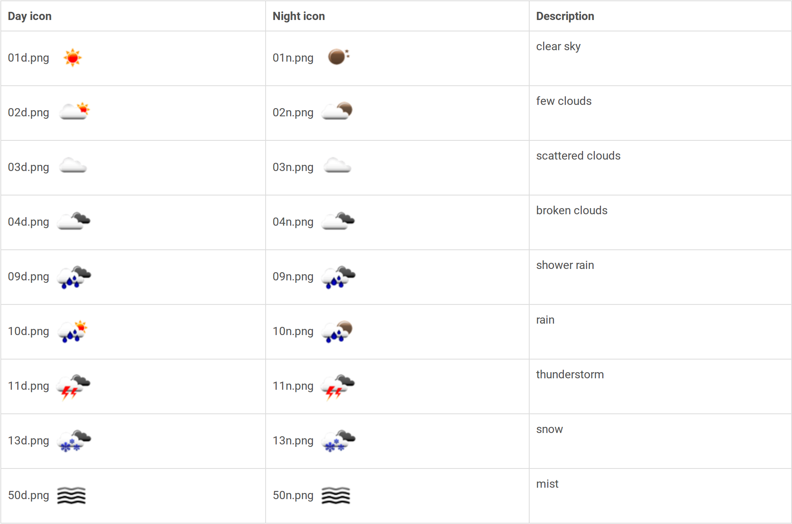

## Getting the weather with Python

Now it's time to fetch the weather forecast using a little bit of Python.

-  Open IDLE (**Menu** > **Programming** > **Python 3 (IDLE)**) and create a new file (**File** > **New File**).
-  With a few lines of Python 3, you can access the OpenWeatherMap API and get the seven-day forecast:

	```python
	import pyowm

	## Copy and paste your key into the line below
	KEY = '1234567890abcdefghijklmnopqrstuvwxyz'

	## Place your location (city, country code) into the line below
	location = 'New York,us'

	owm = pyowm.OWM(KEY)
	fc = owm.three_hours_forecast(location)
	f = fc.get_forecast()
	icons = [weather.get_weather_icon_name() for weather in f]
	```

-  Save the file (**Ctrl** + **s**) and then run it (**F5**); the weather data should now be fetched.
-  To look at the weather data, switch into the Python shell and type:

	```python
	icons
	```

	You should see some data that looks like this:

	```python
	['02d', '10d', '01d', '01d', '10d', '10d', '01d']
	```

These strings represent icons that describe the weather at your location. You can see what they mean by looking at the [OpenWeatherMap website](http://openweathermap.org/weather-conditions), or look at the image below:



