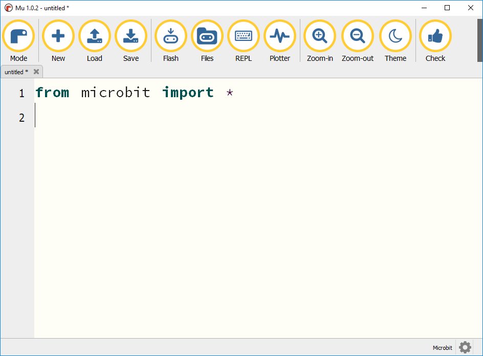

## Displaying weather icons

-  Next, you're going to write some MicroPython code for the micro:bit to display the weather icons.

-  Connect your micro:bit to the Raspberry Pi using a USB A-to-micro-B cable.

-  Open mu (**Menu** > **Programming** > **mu**) 

-  A window should open that looks like this:

	

Now you need to create your weather icons. The micro:bit has a 5x5 LED matrix. Each LED's brightness can be set to a value between 0 and 9, with 0 being off and 9 being the brightest.

-  To create an image, use the following syntax:

	```python
	sun = Image('00000:'
			'00900:'
			'09990:'
			'00900:'
			'00000:')
	```

-  The above would set the entire top row of pixels to be off. The second row of pixels would have the middle pixel set to the brightest level.

-  To see the image, you can add a single line and then `Flash` the program:

	```python
	sun = Image('00000:'
			'00900:'
			'09990:'
			'00900:'
			'00000:')

	display.show(sun)
	```

The sun icon should now be displayed on your micro:bit.

-  Next, you need to create an image for each icon shown above. You can use the ones below, or be a little more creative and make your own. To save space, the images have been written on a single line:

	```python
	sun = Image('00000:00900:09990:00900:00000:')
	few = Image('04040:44444:04040:00000:00000:')
	cloud = Image('06060:66666:06060:00000:00000:')
	broken = Image('09090:99999:09090:00000:00000:')
	shower = Image('09090:99999:09090:30303:03030:')
	rain = Image('07070:77777:07070:20202:02020:')
	thunder = Image('90090:09009:00900:09009:90090:')
	snow = Image('70707:07070:70707:07070:70707:')
	mist = Image('22222:33333:22222:33333:22222:')
	```

-  Test each of your images, to make sure they look okay.

