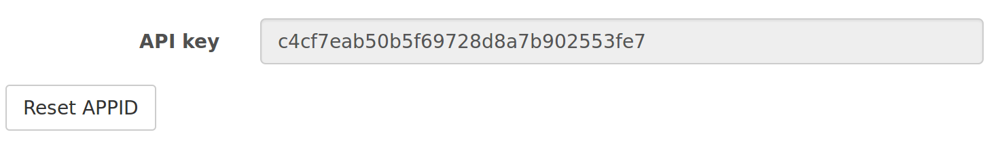

# micro:bit meteorologist

In this resource, you'll use your Raspberry Pi to fetch a seven-day weather forecast. It can then send the data over to your micro:bit, which will display a graphic on its 5x5 LED matrix to show the weather.

## Accessing OpenWeatherMaps

The first thing you'll have to do is get access to a **weather API**. API stands for Application Programming Interface. This sounds complicated, but it's just a set of rules telling your programs how to talk to other software.

1.  The weather service you're going to use in this resource is called [OpenWeatherMap](http://openweathermap.org/). It's a completely free service, and has an easy-to-use API. You're going to need your own account though, so click on the link to go to the website.

1.  Click on 'Sign Up':

	

1.  Choose a username, type in your email address and then provide a password:

	

1.  Once you're logged in, you should see a page with your **secret** API key. This is important, so copy it to your clipboard:

	

## Getting the weather with Python

Now it's time to fetch the weather forecast using a little bit of Python.

1.  Open IDLE (**Menu** > **Programming** > **Python 3 (IDLE)**) and create a new file (**File** > **New File**).
1.  With a few lines of Python 3, you can access the OpenWeatherMap API and get the seven-day forecast:

	```python
	import pyowm

	## Copy and paste your key into the line below
	KEY = '61a75f732e10039232d4122fbff52e96'

	## Place your location (city, country code) into the line below
	location = 'New York,us'

	owm = pyowm.OWM(KEY)
	fc = owm.daily_forecast(location)
	f = fc.get_forecast()
	icons = [weather.get_weather_icon_name() for weather in f]
	```

1.  Save the file (**Ctrl** + **s**) and then run it (**F5**); the weather data should now be fetched.
1.  To look at the weather data, switch into the Python shell and type:

	```python
	icons
	```

You should see some data that looks like this:

	```python
	['02d', '10d', '01d', '01d', '10d', '10d', '01d']
	```

These strings represent icons that describe the weather at your location. You can see what they mean by looking at the [OpenWeatherMap website](http://openweathermap.org/weather-conditions), or look at the image below:


## Displaying weather icons

1.  Next, you're going to write some MicroPython code for the micro:bit to display the weather icons.

1.  Connect your micro:bit to the Raspberry Pi using a USB A-to-micro-B cable.

1.  Open mu (**Menu** > **Programming** > **mu**) 

1.  A window should open that looks like this:

	

Now you need to create your weather icons. The micro:bit has a 5x5 LED matrix. Each LED's brightness can be set to a value between 0 and 9, with 0 being off and 9 being the brightest.

1.  To create an image, use the following syntax:

	```python
	sun = Image('00000:'
			'00900:'
			'09990:'
			'00900:'
			'00000:')
	```

1.  The above would set the entire top row of pixels to be off. The second row of pixels would have the middle pixel set to the brightest level.

1.  To see the image, you can add a single line and then `Flash` the program:

	```python
	sun = Image('00000:'
			'00900:'
			'09990:'
			'00900:'
			'00000:')

	display.show(sun)
	```

The sun icon should now be displayed on your micro:bit.

1.  Next, you need to create an image for each icon shown above. You can use the ones below, or be a little more creative and make your own. To save space, the images have been written on a single line:

	```python
	sun = Image('00000:00900:09990:00900:00000:')
	few = Image('04040:44444:04040:00000:00000:')
	cloud = Image('06060:66666:06060:00000:00000:')
	broken = Image('09090:99999:09090:00000:00000:')
	shower = Image('09090:99999:09090:30303:03030:')
	rain = Image('07070:77777:07070:20202:02020:')
	thunder = Image('90090:09009:00900:09009:90090:')
	snow = Image('70707:07070:70707:07070:70707:')
	mist = Image('22222:33333:22222:33333:22222:')
	```

1.  Test each of your images, to make sure they look okay.

## Communication between the micro:bit and the Raspberry Pi

1.  The micro:bit and the Raspberry Pi can communicate over USB. You'll need another `import` line at the top of your Python file, so switch back into IDLE and add a line so it looks like this:

	```python
	import pyowm
	import serial

	KEY = '61a75f732e10039232d4122fbff52e96'
	location = 'New York,us'
	owm = pyowm.OWM(KEY)
	fc = owm.daily_forecast(location)
	f = fc.get_forecast()
	icons = [weather.get_weather_icon_name() for weather in f]
	```

1.  To set up communication, you need to set some variables:

	```python
	## Edit the line below to the correct port
	PORT = "/dev/ttyACM0"
	##
	BAUD = 115200
	s = serial.Serial(PORT)
	s.baudrate = BAUD
	s.parity   = serial.PARITY_NONE
	s.databits = serial.EIGHTBITS
	s.stopbits = serial.STOPBITS_ONE
	s.readline()
	```

1.  The `PORT` line will vary, depending on what else you have connected to the Raspberry Pi. To see which port your micro:bit is connected to, disconnect it from your Raspberry Pi and then type the following in LXTerminal:

	```bash
	ls /dev/ttyA*
	```

1.  Reconnect the micro:bit and type the line again:

	```bash
	ls /dev/ttyA*
	```

1.  You should see a new entry in the list. This is the port that your micro:bit is connected to, so edit the line in the Python file to show the correct port.

1.  Save and run the file, and check that you receive no errors.

## Sending the weather

Next, you're going to send the weather data from the list of icons over to the micro:bit. The particular icon that will be sent will depend on the micro:bit's button pushes.

1.  Start off by setting the icon to send as the `0`th item in the list:

	```python
	icon = 0
	```

1.  Next, within an infinite loop, you can send the icon to the micro:bit. The data needs to be **encoded** before it can be sent:

	```python
	while True:
		s.write(icons[icon%len(icons)].encode('utf-8'))

	s.close()
	```

## Receiving the weather data

1.  Switch back to mu.

1.  To choose the correct image, you'll need to store them in a dictionary. Add the following lines to your MicroPython file in mu:

   ```python
   weather = {'01d': sun, '02d':few, '03d': cloud, 
		  '04d': broken, '09d': shower, '10d':rain,
		  '11d':thunder, '13d':snow, '50d': mist}
   ```

1.  Now, within an infinite loop, you can get the current weather from the Raspberry Pi and display the correct weather icon. The data that is sent from the Raspberry Pi needs to be **decoded**:

	```python
	while True:
		sleep(500)
		try:
		    bytestring = uart.readline()
		    icon = weather[str(bytestring,'utf-8')]
		    display.show(icon)
		except:
		    pass
	```

1.  Flash the program to your micro:bit, then switch back over to IDLE and run the Python program there. You should see a weather icon displayed on the micro:bit.

## Cycling over the forecast

The weather data collected by the Raspberry Pi is a seven-day forecast. The next step will be to allow the micro:bit to cycle over the forecast. To do this, you'll need to let the micro:bit talk to the Raspberry Pi. This is easy to do using `print()` statements.

1.  In mu, create a function to get the micro:bit's button pushes:

	```python
	def get_sensor_data():
		a, b = button_a.was_pressed(), button_b.was_pressed()
		print(a, b)
	```

1.  Then call the function in the `while` loop:

	```python
	while True:
		sleep(500)
		get_sensor_data()
		try:
		    bytestring = uart.readline()
		    icon = weather[(str(bytestring))[2:-1]]
		    display.show(icon)
		except:
		    pass
	```

1.  Back in IDLE, you need to get the Raspberry Pi to read the data sent from the micro:bit. Change the `while` loop so that it looks like this:

	```python
	while True:
		s.write(icons[icon%len(icons)].encode('utf-8'))
		data = s.readline().decode('UTF-8')
		data_list = data.rstrip().split(' ')
	```

1.  The `data_list` should now contain the data sent from the micro:bit. It should contain `True` and `False` data types, depending on whether button A or button B has been pushed. You can now change the value of `icon` if the buttons are pushed.

	```python
	while True:
		s.write(icons[icon%len(icons)].encode('utf-8'))
		data = s.readline().decode('UTF-8')
		data_list = data.rstrip().split(' ')
		try:
		    a,b = data_list
		    if a == 'True':
			    icon -= 1
			    print(icon%len(icons))
		    if b == 'True':
			    icon += 1
			    print(icon%len(icons))
		except:
		    pass
	```

1.  Try flashing the micro:bit again and then running the program. Pushing button A or B should cycle through the weather icons for your current location. If something isn't working, then check your code with the complete code listings below.

### micro:bit code

```python
from microbit import *

sun = Image('00000:'
	    '00900:'
	    '09990:'
	    '00900:'
	    '00000:')
few = Image('04040:'
	    '44444:'
	    '04040:'
	    '00000:'
	    '00000:')
cloud = Image('06060:'
	      '66666:'
	      '06060:'
	      '00000:'
	      '00000:')
broken = Image('09090:'
	       '99999:'
	       '09090:'
	       '00000:'
	       '00000:')
shower = Image('09090:'
	       '99999:'
	       '09090:'
	       '30303:'
	       '03030:')
rain = Image('07070:'
	     '77777:'
	     '07070:'
	     '20202:'
	     '02020:')
thunder = Image('90090:'
		'09009:'
		'00900:'
		'09009:'
		'90090:')
snow = Image('70707:'
	     '07070:'
	     '70707:'
	     '07070:'
	     '70707:')
mist = Image('22222:'
	     '33333:'
	     '22222:'
	     '33333:'
	     '22222:')

weather = {'01d': sun, '02d':few, '03d': cloud, 
	   '04d': broken, '09d': shower, '10d':rain,
	   '11d':thunder, '13d':snow, '50d': mist}

def get_sensor_data():
    a, b = button_a.was_pressed(), button_b.was_pressed()
    print(a, b)

while True:
    sleep(500)
    get_sensor_data()
    try:
	    bytestring = uart.readline()
	    icon = weather[(str(bytestring))[2:-1]]
	    display.show(icon)
    except:
	    pass
```

### Raspberry Pi code

```python
import pyowm
import serial

KEY = '61a75f732e10039232d4122fbff52e96'
location = 'New York,us'
owm = pyowm.OWM(KEY)
fc = owm.daily_forecast(location)
f = fc.get_forecast()
icons = [weather.get_weather_icon_name() for weather in f]

PORT = "/dev/ttyACM0"
BAUD = 115200
s = serial.Serial(PORT)
s.baudrate = BAUD
s.parity   = serial.PARITY_NONE
s.databits = serial.EIGHTBITS
s.stopbits = serial.STOPBITS_ONE
s.readline()

icon = 0

while True:
    s.write(icons[icon%len(icons)].encode('utf-8'))
    data = s.readline().decode('UTF-8')
    data_list = data.rstrip().split(' ')
    try:
	    a,b = data_list
	    if a == 'True':
	        icon -= 1
	        print(icon%len(icons))
	    if b == 'True':
	        icon += 1
	        print(icon%len(icons))
    except:
	    pass

s.close()
```

## What next?

-   You could make some changes to the code to give animated weather icons. Have a look at the [documentation](https://microbit-micropython.readthedocs.org/en/latest/) to see how to make animations for the micro:bit.
-   You could use [Touch Develop](https://www.touchdevelop.com/microbit) to write your micro:bit code. This uses the Bluetooth functionality to communicate with a computer and receive weather data, giving you a portable meteorologist.
